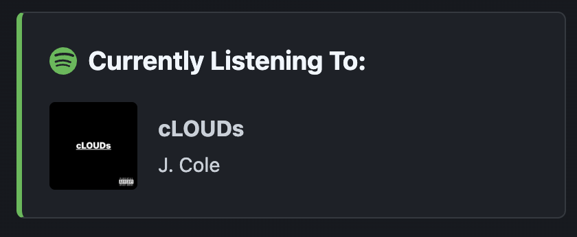

# Spotify Now Playing API

A small serverless API, deployed on Vercel, that returns the track I'm currently playing on Spotify as JSON. It powers the "Currently Listening To" widget on my portfolio: https://nullamnesiac.github.io

The API exists so the Spotify credentials stay on the server. The portfolio is a static site, so anything placed in its code would be public.

## Preview



## How it works

1. The client calls `GET /api/now-playing`.
2. The function exchanges a long-lived Spotify **refresh token** for a short-lived access token.
3. It calls Spotify's `currently-playing` endpoint with that access token.
4. It returns a simplified JSON response to the client.

Responses are cached at the edge for 10 seconds (`Cache-Control: s-maxage=60`), so frequent polling from the widget doesn't hit Spotify on every request.

## Response format

While a track is playing:

```json
{
  "isPlaying": true,
  "title": "Track name",
  "artist": "Artist One, Artist Two",
  "albumImageUrl": "https://...",
  "songUrl": "https://open.spotify.com/track/..."
}
```

When nothing is playing, or Spotify returns an error:

```json
{ "isPlaying": false }
```

## Setup

### 1. Create a Spotify app

Create an app in the [Spotify Developer Dashboard](https://developer.spotify.com/dashboard) and note the **Client ID** and **Client Secret**. Add a redirect URI you control for the one-time authorization step.

### 2. Get a refresh token

Authorize your own Spotify account once using the [Authorization Code flow](https://developer.spotify.com/documentation/web-api/tutorials/code-flow) with the `user-read-currently-playing` scope. Exchange the returned code for tokens and save the **refresh token**.

### 3. Set environment variables

| Variable | Description |
| --- | --- |
| `SPOTIFY_CLIENT_ID` | Client ID from your Spotify app |
| `SPOTIFY_CLIENT_SECRET` | Client secret from your Spotify app |
| `SPOTIFY_REFRESH_TOKEN` | Refresh token from step 2 |

On Vercel, add these under **Project Settings → Environment Variables**. For local development, copy `.env.example` to `.env` and fill in the values. `.env` is listed in `.gitignore` and must never be committed.

### 4. Deploy

Import the repo into Vercel, set the environment variables, and deploy. The endpoint will be available at `https://<your-project>.vercel.app/api/now-playing`.

## Security notes

- Credentials are read only from environment variables, never from source code.
  - Failed Spotify requests return `{ "isPlaying": false }`, and unexpected errors return a generic 500 message, with no upstream error details.
- CORS is currently open (`Access-Control-Allow-Origin: *`) because the data is public now-playing info. It can be restricted to a single origin if needed.

## Tech

JavaScript (Node.js), Spotify Web API, Vercel serverless functions.
